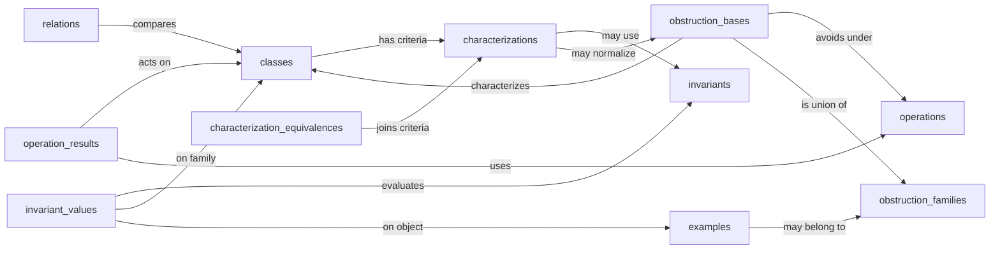

# Partial Cubes database schema and design rationale

The schema described here is implemented in `data/*/schema.json`. It supports
the existing survey hierarchy and minor atlas while leaving room for theorems
from the other manuscripts.

## Recommended scope for the first release

The first release should catalogue:

- named classes of partial cubes and closely related ambient classes;
- their alternative characterizations in graph, set-family, medium,
  sign-vector, invariant, obstruction, and cubical-complex language;
- theorem records proving that specified characterizations are equivalent;
- established, open, and refuted comparisons between classes;
- closure and image results for standard operations;
- structural invariants and their exact values, formulas, bounds, and ranges;
- complete or partial forbidden-minor bases built from reusable obstruction
  families;
- named examples and counterexamples used as witnesses;
- theorem-level source locations and bibliography references;
- broader class results that do not fit a binary relation.

This scope is large enough to absorb both existing structured atlases, but it
does not attempt to store active proof campaigns, raw computational evidence,
or every theorem in all twelve papers.

## Core conventions

- Every record has an integer `id` and stable snake-case `short_name`.
- Filenames use `NNN_short_name.json`.
- Foreign keys use `#table/short_name`.
- Mathematical content uses Markdown with dollar-delimited TeX, following the
  existing `math_database` convention.
- `status` is separate from the mathematical type of a statement. Recommended
  values are `established`, `conjectured`, `open`, `needs_verification`, and
  `refuted`.
- A source citation never substitutes for status. An established record needs
  a proof, a precise theorem source, or a source record identifying the claim
  as definitional or computational.
- Stored inclusion records are asserted direct facts. Transitive consequences
  are derived, not duplicated.
- Diagram coordinates and routes live in graph-view configuration, not in
  mathematical records.

## Table 1: `classes`

One record represents one canonical class in the database's partial-cube
dictionary. Standard definitions in other models are attached through
`characterizations` rather than duplicated as unrelated class records.

Proposed fields:

| Field | Type | Required | Meaning |
|---|---|---:|---|
| `id` | integer | yes | Stable numeric ID |
| `short_name` | string | yes | Stable cross-reference key |
| `name` | string | yes | Canonical display name |
| `symbol` | latex | no | Bare TeX symbol |
| `summary` | text | yes | Concise description of the class |
| `primary_characterization_id` | string | yes | `#characterizations/...` used as the catalogue definition |
| `graph_label` | string | no | Concise hierarchy label |
| `aliases` | array | no | Searchable alternate names |
| `category` | enum | yes | Broad visual/editorial group |
| `ambient_scope` | enum | yes | Partial cubes only, bipartite graphs, all graphs, set families, or mixed |
| `parameterized` | boolean | no | Whether the name denotes a parameterized family |
| `parameters` | text | no | Formal parameter conventions when applicable |
| `p_closed` | boolean | no | Cached established projection-closure status |
| `c_closed` | boolean | no | Cached established conditioning-closure status |
| `pc_closed` | boolean | no | Cached established pc-minor-closure status |
| `comments` | text | no | Catalogue notes and scope qualifications |
| `latex_label` | string | no | Stable generated-definition label or mapping aid |
| reverse references | reference | no | Characterizations, relations, operation results, invariant values, bases, results, and examples |

Initial `category` values should follow the useful visual split already present
in the survey atlas: `core`, `metric_cubical`, `expansion_boundary`,
`set_family`, `sign_vector_com`, `symmetry`, and `named_family`. This is a
presentation category, not a theorem.

`ambient_scope` prevents a statement about all bipartite graphs or COM tope
graphs from silently acquiring a partial-cube-only interpretation.

The three closure fields are useful for filtering, compact class cards, and
the overview table, so they belong on the class record. They are materialized
summaries rather than independent proof sources:

- `true` means an established `closed_under` operation result exists;
- `false` means an established `not_closed_under` result exists;
- omission or `null` means open, unclassified, or not applicable.

The proof, qualifications, counterexample, and provenance remain in
`operation_results`. A validator should derive the three summary values from
the canonical projection, conditioning, and pc-minor operation records and
reject drift. Under the adopted operation conventions, pc-closure is
equivalent to simultaneous p- and c-closure; the validator should enforce the
resulting logical implications while retaining `pc_closed` as a useful
displayed field.

## Table 2: `characterizations`

Each record is one atomic predicate used as a criterion for membership in a
class. It may be used as the primary definition, but most records are
alternative intrinsic, representational, algebraic, invariant, generative,
algorithmic, or forbidden-minor criteria.

Proposed fields:

| Field | Type | Required | Meaning |
|---|---|---:|---|
| `id` | integer | yes | Stable numeric ID |
| `short_name` | string | yes | Stable key |
| `name` | string | yes | Characterization name |
| `class_id` | string | yes | Characterized `#classes/...` |
| `characterization_type` | enum | yes | See below |
| `model_type` | enum | no | graph, set family, medium, sign system, complex, or mixed |
| `statement` | text | yes | Predicate imposed on a candidate object |
| `hypotheses` | text | no | Ambient assumptions and parameter range |
| `status` | enum | yes | Epistemic status |
| `invariant_ids` | array | no | Invariants occurring in the criterion |
| `obstruction_basis_id` | string | no | Structured `#obstruction_bases/...` record |
| `recognition_complexity` | text | no | Complexity when the criterion is algorithmic |
| `references` | text | no | BibTeX citations and published references |
| `proof_source` | text | no | Stable local path/label or exact theorem locator |
| `comments` | text | no | Scope and terminology notes |

Recommended `characterization_type` values are `definitional`,
`intrinsic_metric`, `set_system`, `medium`, `sign_vector`, `complex`,
`orientation`, `expansion`, `recursive`, `generative`, `invariant_condition`,
`forbidden_minor`, `algorithmic`, and `other`.

The record states the predicate, but does not duplicate its equivalence proof.
For example, the isometric-hypercube, transitive-$\Theta$, well-graded-family,
and medium criteria for partial cubes are four characterization records.

## Table 3: `characterization_equivalences`

This table stores the theorem proving that two or more characterization
records describe the same class. A theorem with five equivalent conditions is
one record with five references, rather than ten pairwise claims or five copies
of the same proof.

Proposed fields:

| Field | Type | Required | Meaning |
|---|---|---:|---|
| `id` | integer | yes | Stable numeric ID |
| `short_name` | string | yes | Stable key |
| `name` | string | yes | Equivalence theorem title |
| `class_id` | string | yes | Common `#classes/...` target |
| `characterization_ids` | array | yes | At least two `#characterizations/...` references |
| `hypotheses` | text | no | Common ambient assumptions |
| `statement` | text | no | Refinement of “these conditions are equivalent” |
| `status` | enum | yes | Epistemic status |
| `proof` | text | no | Concise database-owned equivalence proof |
| `references` | text | no | BibTeX citations and published references |
| `proof_source` | text | no | Stable local path/label or exact theorem locator |
| `comments` | text | no | Direction-specific qualifications |

Validation should require every established non-primary characterization to be
connected to the class's primary characterization through established
equivalence records. A two-condition theorem naturally has an array of length
two. Implication-only theorems remain ordinary `results`; they do not promote a
condition to a characterization until the converse is established.

## Table 4: `relations`

This table stores binary comparisons between canonical classes.

Proposed fields:

| Field | Type | Required | Meaning |
|---|---|---:|---|
| `id` | integer | yes | Stable numeric ID |
| `short_name` | string | yes | Stable key |
| `name` | string | yes | Human-readable record title |
| `subject_id` | string | yes | `#classes/...` |
| `object_id` | string | yes | `#classes/...` |
| `relation_type` | enum | yes | See below |
| `status` | enum | yes | Epistemic status |
| `scope` | text | no | Ambient and parameter qualifications |
| `statement` | text | no | Precise formulation beyond the typed endpoints |
| `witness_ids` | array | no | `#examples/...` strictness or separation witnesses |
| `proof` | text | no | Concise database proof |
| `references` | text | no | BibTeX citations and published references |
| `proof_source` | text | no | Stable local path/label or exact theorem locator |
| `comments` | text | no | Curatorial notes |

Recommended `relation_type` values:

- `inclusion`: subject is contained in object;
- `strict_inclusion`: subject is properly contained in object;
- `equality`: the two named class descriptions define the same class;
- `noncontainment`: subject is not contained in object;
- `incomparable`: neither class contains the other;
- `overlap`: a positive intersection result when neither inclusion is meant;
- `comparison`: a deliberately untyped proposed comparison, normally with
  `status: open`.

Direction is always subject to object. A proper established inclusion is
`relation_type: strict_inclusion` with `status: established`. An open question
“is A contained in B?” is still `relation_type: inclusion` with `status: open`;
`comparison` is reserved for questions whose direction has not been
formulated.

The graph hook should use established inclusions for the Hasse backbone,
derive a transitive reduction, and render open inclusions, non-containments,
incomparabilities, or refutations as non-ranking overlays.

## Table 5: `operations`

Operations recur across many class records and should be defined once.

Proposed fields:

| Field | Type | Required | Meaning |
|---|---|---:|---|
| `id` | integer | yes | Stable numeric ID |
| `short_name` | string | yes | Stable key |
| `name` | string | yes | Operation name |
| `symbol` | latex | no | Bare TeX notation |
| `arity` | integer | yes | Number of class inputs |
| `definition` | text | yes | Formal definition |
| `category` | enum | no | Minor, product, expansion, complement, reduction, gluing, etc. |
| `comments` | text | no | Scope and conventions |
| `references` | text | no | BibTeX citations and published references |
| `proof_source` | text | no | Stable local path/label or exact theorem locator |

The initial operation catalogue should include projection, conditioning,
pc-minor, full reduction, Cartesian product, cube complement, restriction,
expansion, and the gluing operations used by the papers. “Projection followed
by conditioning” should have one canonical convention matching the manuscripts.

## Table 6: `operation_results`

This table stores closure, failure, and exact closure/image theorems. It
normalizes the `p`, `c`, `pc`, `c_closure`, and `pc_closure` fields of the minor
atlas.

Proposed fields:

| Field | Type | Required | Meaning |
|---|---|---:|---|
| `id` | integer | yes | Stable numeric ID |
| `short_name` | string | yes | Stable key |
| `name` | string | yes | Record title |
| `class_id` | string | yes | Subject `#classes/...` |
| `operation_id` | string | yes | `#operations/...` |
| `result_type` | enum | yes | See below |
| `target_class_id` | string | no | Exact or bounding output class |
| `status` | enum | yes | Epistemic status |
| `statement` | text | no | Quantifiers and qualifications |
| `witness_ids` | array | no | Failure or strictness examples |
| `proof` | text | no | Concise proof |
| `references` | text | no | BibTeX citations and published references |
| `proof_source` | text | no | Stable local path/label or exact theorem locator |

Recommended `result_type` values:

- `closed_under`: every allowed output remains in the same class;
- `not_closed_under`: a witness output leaves the class;
- `closure_equals`: the operation closure is exactly `target_class_id`;
- `image_contained_in`: every output lies in `target_class_id`;
- `image_contains`: the image contains `target_class_id`;
- `preserves_between`: the operation maps the subject class into a different
  target class under the stated hypotheses.

For example, maximum classes under projection give `closed_under`; maximum
classes under conditioning give `closure_equals` with target MaxMin.

## Table 7: `invariants`

An invariant record defines a function on individual concept classes or
partial cubes. It is intentionally analogous to a parameter record in the
Combinatorial Parameters database, but its domain and normalization are part
of the definition here.

Proposed fields:

| Field | Type | Required | Meaning |
|---|---|---:|---|
| `id` | integer | yes | Stable numeric ID |
| `short_name` | string | yes | Stable key |
| `name` | string | yes | Invariant name |
| `symbol` | latex | yes | Bare TeX symbol |
| `definition` | text | yes | Formal definition on one object |
| `status` | enum | yes | Epistemic status of the recorded definition |
| `domain_class_id` | string | no | Broadest catalogued `#classes/...` domain |
| `codomain` | string | yes | Integers, reals, vectors, tables, etc. |
| `parameters` | text | no | Field, root, order, or other auxiliary choices |
| `normalization` | text | no | Conventions needed for comparable values |
| `category` | enum | no | combinatorial, metric, algebraic, topological, geometric, or algorithmic |
| `isomorphism_invariant` | boolean | no | Whether it descends to the intended object isomorphism |
| `comments` | text | no | Scope and known limitations |
| `references` | text | no | BibTeX citations and published references |
| `proof_source` | text | no | Stable local path/label or exact theorem locator |
| reverse references | reference | no | Values and characterizations using this invariant |

The initial inventory can include ordering width, majority-completion defect,
resolution slope and rounded slope defect, separation margin, Yang depth and
its defect where the conventions are settled, and other invariants selected
from the reviewed manuscripts. Quantities still confined to exploratory notes
should enter with `status: needs_verification` or wait until promoted; adding a
record should not itself assert a class characterization.

## Table 8: `invariant_values`

This table records what is known about an invariant on a named class or a named
example. Since a class record usually denotes a family of objects, the
quantifier and value type are essential.

Proposed fields:

| Field | Type | Required | Meaning |
|---|---|---:|---|
| `id` | integer | yes | Stable numeric ID |
| `short_name` | string | yes | Stable key |
| `name` | string | yes | Record title |
| `invariant_id` | string | yes | `#invariants/...` |
| `class_id` | string | no | Subject family `#classes/...` |
| `example_id` | string | no | Subject object `#examples/...` |
| `quantifier` | enum | yes | See below |
| `value_type` | enum | yes | See below |
| `value` | string | yes | Exact value, formula, bound, or range in TeX-aware text |
| `parameters` | text | no | Parameter range and dependence |
| `scope` | text | no | Ambient assumptions, field, normalization, etc. |
| `status` | enum | yes | Epistemic status |
| `proof` | text | no | Concise proof |
| `references` | text | no | BibTeX citations and published references |
| `proof_source` | text | no | Stable local path/label or exact theorem locator |
| `verification` | text | no | Script/certificate pointer when relevant |

Exactly one of `class_id` and `example_id` must be present. Recommended
`quantifier` values are `individual`, `all_members`, `some_member`,
`supremum`, `infimum`, and `attained_range`. Recommended `value_type` values
are `exact`, `formula`, `lower_bound`, `upper_bound`, `range`, `unbounded`, and
`unknown`.

An invariant value is not automatically a characterization. For example,
“every ample class has invariant zero” records only one direction. The
converse “invariant zero implies ample” belongs in an
`invariant_condition` characterization and must be connected to the primary
definition by a characterization-equivalence theorem. This distinction avoids
turning useful necessary conditions into false recognition theorems.

Examples of the intended representation are:

- the rounded resolution-slope defect is zero exactly on ample classes: one
  invariant definition, a universal zero value, and an invariant-condition
  characterization of `ample`;
- ordering width zero characterizes the corner-peelable/dismantlable ample
  class under the stated ambient hypotheses;
- an exact cycle formula is one `invariant_values` record attached to the
  parameterized even-cycle class;
- positivity of separation margin characterizes the geometrically realizable
  ample class, with its normalization and domain made explicit.

## Table 9: `obstruction_families`

An obstruction family is a reusable, possibly parameterized collection of
objects. It is not the same thing as the target class that the objects exclude,
and it does not by itself claim completeness of a forbidden-minor basis.

Proposed fields:

| Field | Type | Required | Meaning |
|---|---|---:|---|
| `id` | integer | yes | Stable numeric ID |
| `short_name` | string | yes | Stable key |
| `name` | string | yes | Family name |
| `symbol` | latex | no | Bare TeX symbol |
| `description_type` | enum | yes | finite, parameterized, generative, recursive, predicate, or mixed |
| `definition` | text | yes | Membership definition or complete construction |
| `parameters` | text | no | Parameter space and identifications |
| `ambient_class_id` | string | no | Containing `#classes/...` universe |
| `catalogued_class_id` | string | no | Same family as a `#classes/...` record, when applicable |
| `canonical_form` | text | no | Normal form and uniqueness statement |
| `recognition` | text | no | Membership test or certificate format |
| `references` | text | no | BibTeX citations and published references |
| `proof_source` | text | no | Stable local path/label or exact theorem locator |
| `comments` | text | no | Limitations and alternate parametrizations |
| reverse references | reference | no | Bases and named examples using this family |

This table can represent the antipodally punctured cubes, the parameterized
daisy obstruction families, critical-incompatible layer lifts, rooted-wedge
families, and proved learning-space obstruction constructions. Separate
records should be used when two descriptions are not known to generate the
same family.

## Table 10: `obstruction_bases`

This table states that avoiding specified obstruction families under a stated
minor/containment notion characterizes, partially characterizes, or is
conjectured to characterize a target class.

Proposed fields:

| Field | Type | Required | Meaning |
|---|---|---:|---|
| `id` | integer | yes | Stable numeric ID |
| `short_name` | string | yes | Stable key |
| `name` | string | yes | Basis theorem title |
| `target_class_id` | string | yes | Characterized `#classes/...` |
| `ambient_class_id` | string | yes | Universe in which avoidance is asserted |
| `minor_operation_id` | string | yes | `#operations/...`, usually pc-minor |
| `obstruction_family_ids` | array | yes | One or more `#obstruction_families/...` |
| `basis_claim` | enum | yes | `complete`, `partial`, `necessary`, or `sufficient` |
| `minimality` | enum | yes | pc-minimal, p-minimal, c-minimal, convex-minimal, or none |
| `statement` | text | yes | Exact avoidance theorem and qualifications |
| `status` | enum | yes | Epistemic status |
| `proof` | text | no | Concise completeness/minimality proof |
| `references` | text | no | BibTeX citations and published references |
| `proof_source` | text | no | Stable local path/label or exact theorem locator |
| `comments` | text | no | Gaps, alternate bases, or uniqueness notes |

Completeness belongs on the basis theorem, not on an obstruction family. The
same punctured-cube family can therefore occur in the complete ample basis and
as one component of another class's basis. Conversely, the complete daisy
basis can reference several obstruction-family records.

`basis_claim` describes the mathematical strength of the proposed statement;
`status` records whether that statement is proved, conjectured, open, or
refuted. Thus a conjectured complete basis uses `basis_claim: complete` and
`status: conjectured`, rather than combining the two meanings in one enum.

Different complete descriptions of the same basis should normally produce
different forbidden-minor characterization records joined by a
`characterization_equivalences` theorem. For example, a coordinate normal form
and an intrinsic deleted-antipode form can be displayed independently while
sharing the same target class and proof provenance.

The link is stored in the characterization's `obstruction_basis_id`; a reverse
reference on the basis page finds the characterization. This avoids maintaining
the same foreign key in both directions.

## Table 11: `examples`

Examples are mathematical objects used to prove strictness, non-containment,
failure of closure, sharpness, or obstruction statements.

Proposed fields:

| Field | Type | Required | Meaning |
|---|---|---:|---|
| `id` | integer | yes | Stable numeric ID |
| `short_name` | string | yes | Stable key |
| `name` | string | yes | Display name |
| `symbol` | latex | no | Bare TeX symbol |
| `object_type` | enum | yes | graph, set family, sign system, family, or construction |
| `definition` | text | yes | Reproducible mathematical description |
| `parameters` | text | no | Family parameters and valid range |
| `properties` | text | no | Concise verified properties |
| `references` | text | no | BibTeX citations and published references |
| `proof_source` | text | no | Stable local path/label or construction locator |
| `verification` | text | no | Script/certificate pointer when relevant |
| `obstruction_family_ids` | array | no | Families containing this named object |

A witness may itself be a named infinite class family. In that case it should
point to a `classes` record instead of being duplicated here; the relation
schema may eventually split `witness_ids` into class and example references if
the shared renderer cannot resolve mixed arrays cleanly.

## Table 12: `results`

This is the controlled escape hatch for important class theorems that are not
binary comparisons or operation results. Keeping it typed avoids accumulating
large unqueryable prose fields on class records.

Proposed fields:

| Field | Type | Required | Meaning |
|---|---|---:|---|
| `id` | integer | yes | Stable numeric ID |
| `short_name` | string | yes | Stable key |
| `name` | string | yes | Result title |
| `class_ids` | array | no | Principal `#classes/...` subjects |
| `invariant_ids` | array | no | Related `#invariants/...` |
| `operation_ids` | array | no | Related `#operations/...` |
| `result_type` | enum | yes | See below |
| `statement` | text | yes | Precise mathematical statement |
| `status` | enum | yes | Epistemic status |
| `proof` | text | no | Concise database proof |
| `references` | text | no | BibTeX citations and published references |
| `proof_source` | text | no | Stable local path/label or exact theorem locator |
| `witness_ids` | array | no | Examples or counterexamples |
| `comments` | text | no | Scope notes |

Initial `result_type` values should be `recognition`, `algorithm`,
`construction`, `implication`, `invariant_law`, and `other`. Characterizations
and obstruction bases use their dedicated tables. Add a new type only when
several records need it. Validation should require at least one class,
invariant, or operation subject.

## Provenance without a `sources` table

A separate source catalogue is not needed initially. It would add an extra
lookup layer while most records already need to state exactly what a source
proves. Instead, every claim-bearing table uses the same three fields:

- `references`: published citations using the database-owned BibTeX keys;
- `proof_source`: a stable local path and LaTeX label, or an exact published
  theorem locator;
- `proof`: a concise database-owned proof when appropriate.

For local material, `proof_source` should use one documented portable form,
for example
`PartialCubes:papers/survey/main.tex#thm:partial-cube-wellgraded-medium`,
rather than a line number or machine-specific absolute path. The 33 source
records in the minor atlas remain valuable migration input: their citation,
path, and theorem-locator data should be copied into the mathematical records
they support.

This follows the successful pattern in Combinatorial Parameters. A normalized
source table can be added later if repeated version metadata, source hashes, or
many-to-many source maintenance becomes burdensome.

## Questions remain in LaTeX

There is no `questions` table in the initial database. Broad research questions
and partial-progress prose remain in the LaTeX papers, ledgers, and dashboards.
The database may still store an open or conjectured `relation`,
`characterization`, or `obstruction_basis` when that precise statement belongs
in the catalogue; it should not reproduce the surrounding research programme.

## How the new tables fit together

The main conceptual separations are:

- `characterizations` store predicates; `characterization_equivalences` store
  proofs that the predicates define the same class.
- `invariant_values` store one-way numerical facts; an invariant becomes a
  recognition criterion only through a characterization and an equivalence
  theorem.
- `obstruction_families` describe collections of forbidden objects;
  `obstruction_bases` state how avoiding one or more such collections defines
  a target class; the corresponding characterization makes this one of the
  class's equivalent membership criteria.

The three requested use cases therefore map as follows:

| Mathematical content | Authoritative record |
|---|---|
| One membership criterion | `characterizations` |
| Proof that several criteria define the same class | `characterization_equivalences` |
| Definition of a structural invariant | `invariants` |
| Formula, bound, or range on a class or example | `invariant_values` |
| Invariant threshold that characterizes a class | `characterizations` plus an equivalence record |
| Parameterized family of pc-minimal nonmembers | `obstruction_families` |
| Complete or partial forbidden-pc-minor theorem | `obstruction_bases` |
| Avoidance criterion as one description of a class | `characterizations` plus an equivalence record |

Semantic validation should enforce at least these rules:

- a class's primary characterization points back to that same class;
- every established alternative characterization is joined to the primary one
  by an established equivalence path;
- every characterization in an equivalence record belongs to the declared
  class, and each record contains at least two distinct criteria;
- exactly one of `class_id` and `example_id` is set on an invariant value;
- an invariant-condition characterization names at least one invariant;
- a forbidden-minor characterization names one obstruction basis, and its
  class matches that basis's target class;
- an established complete obstruction basis has proof or precise theorem
  provenance, and every referenced obstruction family uses a compatible
  ambient universe and minimality notion;
- an example listed as a family member has enough definition or verification
  data to replay that membership claim.

A generated class page can therefore have stable sections in this order:

1. primary definition and equivalent characterizations;
2. inclusion and non-containment relations;
3. behavior under operations;
4. invariant profile;
5. forbidden-minor bases and named obstructions;
6. other results and examples.

## Initial graph views

One catalogue should support at least two graph configurations:

1. **Class hierarchy**: the 76-node survey atlas, using established inclusion
   records as the Hasse backbone and optional overlays for negative/open facts.
2. **Minor and closure map**: the focused classes from the minor atlas, with
   operation closure information in popups and selected operation edges or
   badges.

The first view is a class poset. The second is a research map over the same
canonical class IDs. They should not be forced into one overloaded diagram.

## Migration plan implied by the schema

1. Create schemas, `main.json`, validation helpers, and an ownership map.
2. Extract the 76 TikZ node IDs into provisional class records and preserve the
   existing category and graph label.
3. Import the 134 JSON containments as established inclusion records, marking
   their precise proof/source fields as a review queue rather than inventing
   provenance.
4. Reconcile the 24 minor-atlas family IDs with canonical class IDs.
5. Import its 48 relations with their statuses, inclusion strength, witnesses,
   and provenance.
6. Create operation records and convert the `p`, `c`, `pc`, and named closure
   fields into operation results.
7. Split each class's current definition and equivalent criteria into
   characterization records. Import the multi-condition equivalence theorems
   without duplicating their proofs.
8. Create obstruction-family records for the existing finite, parameterized,
   generative, and recursive families. Convert each complete, partial, or open
   basis claim into an obstruction-basis record and a linked characterization.
9. Import reviewed structural invariants, then record exact formulas, bounds,
   ranges, and named-example values with explicit quantifiers. Add an
   invariant-condition characterization only where the converse theorem is
   established.
10. Use the 33 minor-atlas source records to populate each claim's
    `references` and `proof_source`; keep the 13 open questions in LaTeX.
11. Move definitions into the database one class at a time, with a checked map
   from each record to its current LaTeX definition/source label.
12. Generate the website and both graph views.
13. Only after the catalogue is reviewed, generate database-owned class
    definitions or tables back into `~/latex/PartialCubes`.

## Shared renderer implications

The records use only field types already understood by
`math_database`: strings, integers, booleans, text, TeX, enums, arrays, and
computed references. Two small generalizations would improve the generated
record pages but do not block the initial site:

- outbound arrays of `#table/short_name` links render correctly, but the
  current reverse-reference matcher only follows scalar strings. The initial
  schemas therefore omit computed reverse fields for array columns; these can
  be added when the shared matcher supports arrays;
- class pages need table-agnostic aggregation hooks so they can show related
  characterizations, invariant values, obstruction bases, and operation
  results in mathematical sections, analogous to the current hard-coded
  parameter relationship/value panels.

Conditional rules such as “exactly one subject” or “at least two
characterizations” remain project-level semantic validation rather than form
schema features.

## Design recommendation

Use the twelve tables above, but implement them in three coherent stages:

- Stage A: `classes`, `relations`, `operations`, `operation_results`, and
  `examples`, which establish stable identity, provenance, witnesses, proved
  closure summaries, and the broad hierarchy.
- Stage B: `characterizations`, `characterization_equivalences`,
  `obstruction_families`, and `obstruction_bases`, which capture the principal
  structural theory of the classes.
- Stage C: `invariants`, `invariant_values`, and `results`, which add the
  quantitative profile and theorem material beyond membership tests.

The tables should stay separate rather than using one universal `facts` table.
Their endpoint rules, validation, rendering, and graph roles are materially
different. A shared provenance/status convention will still make them feel
like one system.
